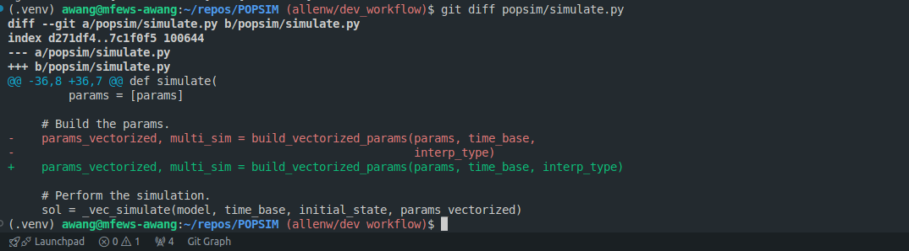
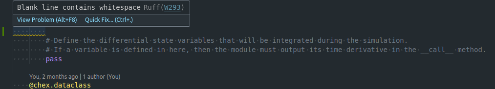

## Dev Install

- Install development related packages with `poetry install --with dev`
- Run `poetry run pre-commit install` to install pre-commit hooks

## Branching
Create a branch off `main` to commit your changes to. For those new to git workflows, [this tutorial](https://webtuu.com/blog/04/git-basics-branching-merging-push-to-github) may be helpful.


The recommended pattern for the branch name is `name/description` (e.g. `allenw/dev_workflow`)

## Pre-Commits
The `dev` install introduces `pre-commit` hooks that need to pass before you can commit. For example, the auto-formatter will run on every commit, and if it detects improperly formatted code you will get an error like that shown below.


In many cases, like the one above, the `pre-commit` will automatically fix the problem for you, and you just need to `git add` the change. In the above example, we can see the formatting fix the pre-commit made with a `git diff`:



Once all pre-commits pass, the commit should go through.

⚠️ **Bypassing pre-commits:** sometimes you may want to bypass the pre-commits. If this is necessary, you can use `git commit --no-verify` to bypass the pre-commits. Note that Github Actions will run the pre-commits on your pull request (PR), so if the issue isn't fixed by that point, CI will fail.

## VSCode Autoformatting + Linting
VSCode users can install the [Python](https://marketplace.visualstudio.com/items?itemName=ms-python.python) and [ruff](https://marketplace.visualstudio.com/items?itemName=charliermarsh.ruff) extensions to have `ruff` autoformat on save by introducing the following into your `settings.json`:
    
```json
{   
    # Other stuff
    "[python]": {
        "editor.formatOnSave": true,
        "editor.codeActionsOnSave": {
            "source.organizeImports": "never" # At the time of writing, there are issues with imports organizing.
        },
        "editor.defaultFormatter": "charliermarsh.ruff"
    },
    # Other stuff
}
```
The ruff extension also helpfully explains to you the issues it finds in the code:


## Automated Tests
POPSIM uses the `pytest` framework for automated testing. For those new to Pytest, the documentation provides a [nice tutorial](https://docs.pytest.org/en/8.2.x/getting-started.html) for getting started. 

Ideally, every function and module would have automated test coverage. Tests are located in the `popsim/tests` directory.


**Running Automated Tests**

To run all of the automated tests, run `poetry run pytest popsim/`.

You can run the tests for just a specific file, for example: `poetry run pytest popsim/tests/test_tree_util.py`

You can also run just one specific test, for example: `poetry run pytest popsim/tests/test_tree_util.py::test_tree_transpose`


## Pull Requests
When you are ready to merge your code back into `main`, you should create a pull request (PR) on Github. For those new to PRs, follow [this tutorial](https://docs.github.com/en/pull-requests/collaborating-with-pull-requests/proposing-changes-to-your-work-with-pull-requests/creating-a-pull-request).

If you would like to indicate that you are not quite ready to merge your code into `main`, but you would like to share the code with others for the purposes of generating discussion and/or soliciting feedback, you should create a "Draft PR" which can be easily done by following the instructions [here](https://docs.github.com/en/pull-requests/collaborating-with-pull-requests/proposing-changes-to-your-work-with-pull-requests/creating-a-pull-request#creating-the-pull-request).


## Building the Documentation
To preview the documentation locally, you can simply run a:
```bash
poetry run EXEC_MKNOTEBOOKS=false mkdocs serve
```
where we recommend setting `EXEC_MKNOTEBOOKS=false` to avoid running the notebooks, which can be slow, until you want to check that the notebook outputs themselves. To see the full list of options for `mkdocs`, check out [their documentation](https://www.mkdocs.org/user-guide/cli/).